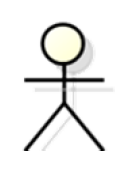
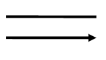
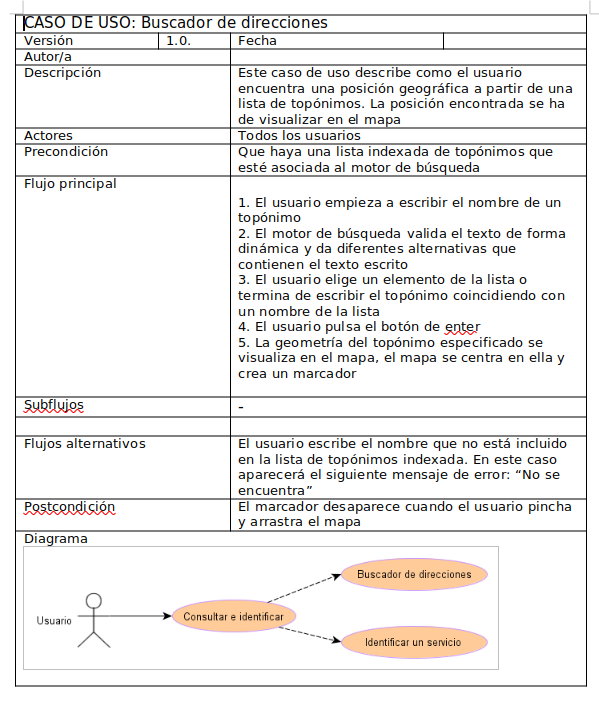
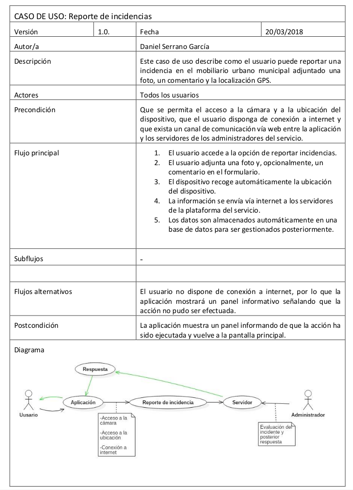
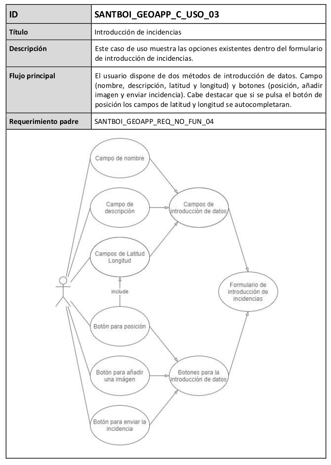

# Casos de Uso

Un factor clave para el éxito de proyectos de desarrollo de software, es lograr hacer una representación correcta, exacta y sin omisiones, de las funciones que debe ejecutar un sistema para satisfacer los requerimientos de clientes y usuarios. En esto, una de las técnicas de mayor difusión en el ámbito académico y empresarial es el Diagrama de casos de uso. [^1]

También podemos considerar un caso de uso como una secuencia de interacciones que se desarrollan entre un sistema y sus actores, en respuesta a un evento que inicia un actor principal sobre el propio sistema. Los diagramas de casos de uso, sirven para especificar la comunicación y comportamiento de un sistema, mostrando la relación entre los actores y el sistema.

La principal ventaja que ofrece esta técnica es que establece un lenguaje común entre desarrolladores, expertos en arquitectura de software y lenguajes de programación, con los usuarios finales que están proporcionando el levantamiento de información.

El caso de uso debe describir una tarea del negocio que responda a un hito del negocio, tener un nivel apropiado de detalle y ser bastante sencillo para ser implementado.

Para cada caso de uso se detallará:

* Nombre caso de uso                                                  
* Descripción
* Condiciones
* Diagrama y flujo
* Requerimientos funcionales

## ¿Qué es el modelo de casos de uso?

En el lenguaje de modelado unificado (UML), los casos de uso son modelos que describen como diferentes tipos de usuarios interactúan con un sistema informático para resolver un determinado problema o necesidades. Por lo tanto, describen los objetivos de los usuarios, las interacciones entre los usuarios y el sistema, así como el comportamiento que debe ejecutar el sistema para satisfacerlos.

La UML es un lenguaje de modelado abierto que permite a los desarrolladores ver los productos de su trabajo en diagramas estandarizados. Se trata de una notación independiente de procesos. No es una metodología de desarrollo, UML no dice que hacer primero ni que hacer después o como diseñar un sistema, en cambio, ayuda a visualizar el diseño y la comunicación entre objetos.

Los casos de uso están compuestos de 3 elementos: Actores, casos de uso y relaciones. Asimismo, una especificación de requerimientos funcionales elaborada bajo la técnica de casos de uso debe estar compuesta por:

* El diagrama de casos de uso.
* La descripción de los actores.
* La especificación de casos de uso.

Se debe tener en cuenta que los diagramas de casos de uso no son más que un índice visual de los casos de uso identificados, ya que la información relevante de los casos de uso (la interacción entre los actores y el sistema) no se ve reflejada en los diagramas sino en la especificación de los propios casos de uso del sistema.

## Elementos del diagrama de casos de uso

La función principal del diagrama de casos de uso es representar los requerimientos de software bajo un lenguaje común entre desarrolladores de software y clientes. Para ello, utilizan los elementos del diagrama de casos de uso que son el actor, los casos de uso y las relaciones. [^2]

### Actor

Representa a una persona o grupo de personas que desempeñan un papel en la interacción con el software. ambién puede ser “cualquier elemento” externo que interactúe con el software para lograr determinados objetivos, como por ejemplo otros sistemas, productos de software y equipamiento.

Se representan con el siguiente símbolo:

### Caso de uso

Representa una funcionalidad (Feature) que cumple uno o varios requisitos. Para el nombre es recomendable usar verbos infinitivos con un complemento. Por ejemplo “Registrar nuevo cliente” en lugar de “Registro de nuevo cliente”.

El símbolo del caso de uso en el diagrama es una elipse con su nombre dentro:

### Relación

La interacción entre dos casos de uso o de un actor con un caso de uso se representa por medio de una relación, utilizando una línea o una flecha.

Se representan con los siguientes símbolos:

## Ejemplos

Caso de uso buscar de direcciones

Caso de uso crear incidencia (comparar 2 diagramas)

## Referencias

[^1]: http://www.pmoinformatica.com/2021/02/diagrama-de-casos-de-uso-definicion-elementos-ejemplos-como-hacer.html
[^2]: http://www.pmoinformatica.com/2021/02/elementos-diagrama-casos-de-uso.html

