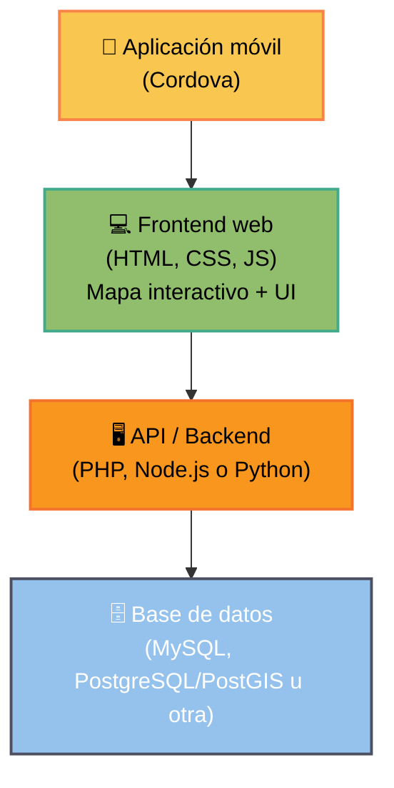
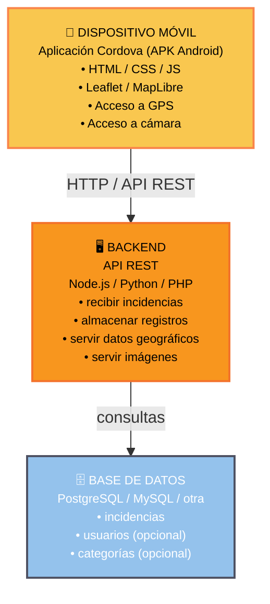

# Proyecto Final – Especialidad de Programación

## Desarrollo de una Geoapp móvil basada en Web

## 1. Objetivo del proyecto

El objetivo del proyecto es diseñar e implementar una **aplicación web
geoespacial (Geoapp)** capaz de visualizar información geográfica en un mapa
interactivo y permitir la **generación de contenido georreferenciado por parte
de los usuarios**.

La aplicación deberá desarrollarse como **web-app utilizando tecnologías web** y
posteriormente empaquetarse como **aplicación móvil Android mediante Apache
Cordova**.

La temática de la aplicación es **libre**. Algunos ejemplos posibles:

- reporte de incidencias urbanas

- inventario colaborativo de elementos (árboles, fuentes, arte urbano, etc.)

- registro de rutas o puntos de interés

- observaciones ambientales o científicas

- turismo colaborativo

El proyecto debe simular un **caso real de desarrollo de una geoapp**,
integrando conocimientos de:

- programación web

- desarrollo de aplicaciones geoespaciales

- gestión de datos geográficos

- desarrollo de aplicaciones móviles híbridas

## 2. Alcance del proyecto

La aplicación deberá permitir:

1. visualizar datos geográficos en un mapa interactivo
1. consultar información asociada a los elementos
1. crear nuevos puntos georreferenciados desde el dispositivo móvil
1. almacenar la información generada por los usuarios
1. ejecutarse como aplicación móvil Android

## 3. Requerimientos funcionales

La aplicación deberá implementar como mínimo las siguientes funcionalidades.

### 3.1 Visualización cartográfica

La aplicación debe:

- Mostrar un mapa interactivo.
- Permitir al usuario realizar:
    - Zoom in
    - Zoom out
    - Desplazamiento (pan)
- Permitir cambiar el mapa base (basemap).

### 3.2 Visualización de datos geográficos

La aplicación deberá:

- Cargar capas geográficas en formato GeoJSON.
- Visualizar dichas capas sobre el mapa.
- Permitir interactuar con los elementos del mapa.
- Mostrar información asociada mediante popups o paneles informativos.

### 3.3 Búsqueda y filtrado

La aplicación deberá permitir:

- Buscar direcciones o lugares mediante una barra de búsqueda.
- Filtrar elementos del mapa mediante controles interactivos (botones,
  categorías, etc.).

### 3.4 Geolocalización del usuario

La aplicación deberá:

- Activar la localización del dispositivo mediante GPS.
- Mostrar la posición actual del usuario en el mapa.

### 3.5 Generación de información por los usuarios

La aplicación deberá permitir al usuario crear nuevos registros geográficos.  
Para ello deberá:

- Obtener la posición del dispositivo.
- Crear un nuevo punto georreferenciado.
- Completar un formulario con información asociada.

El formulario deberá incluir al menos:

- Título o nombre.
- Descripción textual.
- Categoría o tipo.
- Fecha o información adicional.
- Una fotografía tomada con la cámara del dispositivo.

### 3.6 Envío de datos al servidor

La aplicación deberá:

- Enviar la información generada por el usuario a un servidor.
- Almacenar los datos en una base de datos.

### 3.7 Visualización de los datos generados

Los registros creados por los usuarios deberán poder visualizarse:

- En el mapa.
- En formato lista.

Cada registro deberá mostrar:

- Sus atributos.
- La fotografía asociada.

## 4. Requerimientos no funcionales

### 4.1 Plataforma

La aplicación deberá ejecutarse en dispositivos Android.  
El resultado final deberá generarse como una aplicación instalable (APK).

### 4.2 Tecnologías

La aplicación deberá desarrollarse como **web-app** utilizando tecnologías web
abiertas, incluyendo como mínimo:

- HTML
- CSS
- JavaScript

Para el desarrollo del backend o servicios del servidor, los estudiantes podrán
utilizar cualquiera de las siguientes tecnologías:

- PHP
- Node.js
- Python

También podrán utilizar frameworks asociados a estas tecnologías (por ejemplo
**Express**, **Flask**, **Django**, etc.).

### 4.3 Framework móvil

La aplicación deberá empaquetarse como aplicación móvil utilizando:

- Apache Cordova

Cordova permitirá convertir la aplicación web en una aplicación móvil nativa
generando un archivo:

- APK instalable en dispositivos Android

### 4.4 Datos geográficos

La aplicación deberá trabajar con datos geoespaciales en formato estándar.

Los datos podrán provenir de:

- Archivos GeoJSON almacenados localmente en el dispositivo, o
- Servicios o APIs web que proporcionen datos geográficos dinámicamente

Por ejemplo:

- Capas estáticas cargadas desde archivos GeoJSON incluidos en la aplicación
- Capas dinámicas obtenidas mediante llamadas a una API que consulte una base de
  datos

Un caso típico será la capa de puntos generados por los usuarios, que podrá
cargarse mediante una API que recupere los datos almacenados en el servidor.

### 4.5 Base de datos

La información generada por los usuarios deberá almacenarse en una base de datos
en el servidor.

Los estudiantes podrán utilizar el sistema de base de datos que consideren más
adecuado, por ejemplo:

- MySQL / MariaDB
- PostgreSQL / PostGIS
- SQLite
- Otros sistemas equivalentes

En caso de trabajar con datos geográficos avanzados, se recomienda el uso de
**PostgreSQL con PostGIS**.

### 4.6 Funcionamiento

La aplicación deberá:

- Ejecutarse directamente en el dispositivo móvil
- Poder instalarse sin necesidad de software adicional
- Utilizar conexiones a servicios web únicamente cuando sea necesario para
  obtener o enviar información

## 5. Arquitectura mínima recomendada

Aunque la implementación técnica es libre, se recomienda estructurar el proyecto
siguiendo una arquitectura **cliente-servidor**, separando claramente la
interfaz de usuario, la lógica de aplicación y el acceso a los datos.

Una arquitectura típica del proyecto podría organizarse de la siguiente manera:



### 5.1 Aplicación móvil

La aplicación móvil se generará utilizando **Apache Cordova**, que permitirá
empaquetar la aplicación web como una aplicación Android instalable.

La app deberá:

- Acceder a funcionalidades del dispositivo (GPS, cámara)
- Mostrar la interfaz de la aplicación
- Comunicarse con el servidor para enviar y obtener información

### 5.2 Frontend de la aplicación

El frontend será la interfaz principal con el usuario y deberá desarrollarse
utilizando tecnologías web.

Entre sus responsabilidades estarán:

- Visualización del mapa interactivo
- Gestión de la interacción del usuario
- Captura de la posición GPS
- Captura de fotografías mediante la cámara
- Envío de información al servidor
- Carga y visualización de capas geográficas

Se recomienda utilizar librerías de mapas web, por ejemplo:

- Leaflet
- MapLibre GL JS
- OpenLayers

### 5.3 Backend / API

El backend será responsable de gestionar la comunicación entre la aplicación y
la base de datos.

Entre sus funciones estarán:

- Recibir las incidencias enviadas por los usuarios
- Almacenar la información en la base de datos
- Servir datos geográficos a la aplicación
- Proporcionar endpoints para consulta de datos

El backend podrá desarrollarse utilizando:

- PHP
- Node.js
- Python

Se recomienda implementar una **API REST** para facilitar la comunicación entre
la aplicación y el servidor.

### 5.4 Base de datos

La base de datos almacenará:

- Los registros creados por los usuarios
- La información asociada (atributos)
- Las referencias a las imágenes capturadas

Dependiendo del sistema elegido, también podrá almacenar geometrías geográficas.

Opciones habituales:

- MySQL / MariaDB
- PostgreSQL
- PostgreSQL + PostGIS

### 5.5 Flujo básico de funcionamiento

Un flujo típico de uso de la aplicación podría ser el siguiente:

1. El usuario abre la aplicación móvil.
2. La aplicación muestra el mapa con las capas disponibles.
3. El usuario activa su localización mediante GPS.
4. El usuario crea una nueva incidencia o registro.
5. La aplicación obtiene:
    - La posición GPS
    - Los datos del formulario
    - Una fotografía tomada con la cámara
6. La aplicación envía la información al backend mediante una API.
7. El servidor almacena los datos en la base de datos.
8. La aplicación consulta la API para cargar y mostrar las incidencias en el
   mapa.

## 6. Generación de una capa de análisis espacial mediante Python y QGIS

La aplicación deberá incluir una capa temática derivada de un análisis espacial,
generada mediante un script desarrollado en **Python** utilizando las
capacidades de análisis geoespacial de **QGIS**.

El objetivo de esta capa es representar la densidad de elementos puntuales
mediante una cuadrícula regular con simbología coroplética.

### 6.1 Datos de entrada

El script deberá leer una capa de puntos georreferenciados que represente
elementos del territorio (por ejemplo, árboles, farolas, sensores, etc.).

El formato de entrada podrá ser cualquier formato geoespacial compatible con
QGIS, por ejemplo:

- Shapefile
- GeoPackage
- GeoJSON
- Otros formatos soportados por QGIS

### 6.2 Generación de la cuadrícula

A partir de la capa de puntos, el script deberá:

- Generar una cuadrícula regular (grid) que cubra el área de estudio
- Cada celda de la cuadrícula será un polígono
- El tamaño de celda será definido por los estudiantes (por ejemplo 100 m, 250
  m, 500 m, etc.)

### 6.3 Cálculo del número de elementos

Para cada celda de la cuadrícula, el script deberá calcular:

- El número de puntos contenidos dentro de cada celda

Este valor deberá almacenarse como atributo de cada polígono de la cuadrícula.

**Ejemplo:**

```
count = número de elementos dentro de la celda
```

### 6.4 Clasificación de valores

Los valores obtenidos deberán clasificarse en clases estadísticas para permitir
su representación cartográfica.

Se podrá utilizar cualquier método de clasificación, por ejemplo:

- Intervalos iguales
- Cuantiles (cuartiles, quintiles, etc.)
- Natural breaks (Jenks)
- Clasificación personalizada

### 6.5 Asignación de colores

Cada celda deberá tener asociado un color que represente su clase de valor.

- El color deberá almacenarse como atributo en el archivo de salida
- Los colores deberán seguir una paleta coherente para mapas coropléticos, por
  ejemplo:
    - Gradiente claro → oscuro
    - Escala secuencial

### 6.6 Archivo de salida

El resultado del proceso deberá ser un archivo **GeoJSON** que contenga:

- La geometría de la cuadrícula
- El número de elementos por celda
- La clase asignada
- El color asociado

**Ejemplo de atributos:**

```
count : 12
class : 3
color : "#fdae61"
```

Este archivo GeoJSON será posteriormente cargado en la aplicación web para
visualizar el mapa coroplético.

### 6.7 Uso de Python y QGIS

El script deberá desarrollarse en **Python** utilizando el entorno de **QGIS**.

Los estudiantes podrán utilizar:

- La API de Python de QGIS (**PyQGIS**)
- Las herramientas de análisis espacial del Processing Toolbox

Esto permite utilizar directamente funciones de análisis espacial como:

- Generación de cuadrículas
- Conteo de puntos en polígonos
- Intersecciones espaciales
- Cálculo de estadísticas espaciales

## 7. Arquitectura técnica del sistema

La aplicación deberá seguir una arquitectura **cliente–servidor**, donde la
aplicación móvil actúa como cliente que consume servicios proporcionados por un
backend.

El siguiente diagrama muestra la arquitectura general del sistema:



## 8. Modelo mínimo de datos recomendado

Para almacenar las incidencias generadas por los usuarios se recomienda definir
al menos una tabla principal de **incidencias**.  
Cada incidencia representará un punto georreferenciado creado por el usuario.

### 8.1 Tabla: incidencias

| Campo       | Tipo     | Descripción                         |
| ----------- | -------- | ----------------------------------- |
| id          | integer  | identificador único                 |
| titulo      | text     | título de la incidencia             |
| descripcion | text     | descripción                         |
| categoria   | text     | tipo de incidencia                  |
| latitud     | float    | coordenada latitude                 |
| longitud    | float    | coordenada longitude                |
| foto        | text     | ruta o nombre del archivo de imagen |
| fecha       | datetime | fecha de creación                   |

### 8.2 Alternativa con base de datos espacial (PostGIS)

Si se utiliza **PostgreSQL + PostGIS**, en lugar de almacenar latitud y longitud
por separado se puede usar un campo geométrico.

| Campo       | Tipo                 |
| ----------- | -------------------- |
| id          | serial               |
| titulo      | text                 |
| descripcion | text                 |
| categoria   | text                 |
| geom        | geometry(Point,4326) |
| foto        | text                 |
| fecha       | timestamp            |

### 8.3 Relación con la aplicación

El flujo de datos será el siguiente:

1. El usuario crea una incidencia en la aplicación móvil.
2. La app obtiene:
    - Posición GPS
    - Texto del formulario
    - Fotografía
3. La app envía la información a la API del servidor.
4. La API guarda los datos en la base de datos.
5. La aplicación consulta la API para obtener las incidencias y mostrarlas en el
   mapa.
