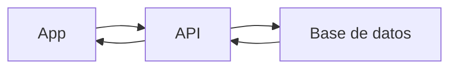

# Memoria

- Extensión: **10–15 páginas**
- Incluir capturas de pantalla
- Priorizar claridad sobre formalismo. _La memoria no debe ser un documento
  teórico, sino una explicación clara de lo que habéis hecho, por qué lo habéis
  hecho así y cómo funciona vuestra aplicación._
- Explicar decisiones (no solo describir herramientas)

# Proyecto Final – Geoapp

## Nombre del proyecto

**Autor(es):**  
**Fecha:**  
**Máster:**

---

# 1. Introducción

## 1.1 Contexto

Describe el contexto del proyecto y el tipo de aplicación desarrollada.

## 1.2 Problema a resolver

Explica qué problema o necesidad aborda la aplicación.

## 1.3 Objetivos

Indica el objetivo principal del proyecto y, objetivos secundarios.

---

# 2. Descripción de la aplicación

## 2.1 Descripción general

Explica qué hace la aplicación y para qué sirve.

## 2.2 Usuarios objetivo

¿A quién va dirigida la aplicación?

## 2.3 Funcionalidades principales

- Visualización de mapa
- Visualización de datos geográficos
- Sistema de incidencias
- Capa coroplética (cuadrícula)

## 2.4 Ejemplos de uso

Incluye capturas de pantalla:

---

# 3. Arquitectura y funcionamiento

## 3.1 Arquitectura general

Describe los componentes del sistema:

- Aplicación móvil (Cordova)
- Frontend (HTML, CSS, JS)
- Backend / API
- Base de datos

## 3.2 Flujo de datos

Explica cómo fluye la información:

- creación de incidencias
- carga de datos
- comunicación con la API

Ejemplo de esquema:



---

# 4. Procesamiento geoespacial (Python + QGIS)

## 4.1 Datos de entrada

Describe la capa de puntos utilizada (ej. árboles).

## 4.2 Generación de la cuadrícula

- tamaño de celda
- método utilizado

## 4.3 Conteo de puntos

Explica cómo se calcula el número de elementos por celda.

## 4.4 Clasificación de valores

Indica el método utilizado:

- intervalos iguales
- cuantiles
- otros

## 4.5 Asignación de colores

Describe la lógica de la paleta utilizada.

## 4.6 Resultado final

Describe el GeoJSON generado.

Ejemplo:

```json
{
    "count": 12,
    "class": 3,
    "color": "#fdae61"
}
```

---

# 5. Desarrollo de la aplicación

## 5.1 Mapa interactivo

- librería utilizada (Leaflet, MapLibre, etc.)
- funcionalidades implementadas:
    - zoom
    - pan
    - cambio de mapa base

## 5.2 Visualización de datos

- carga de GeoJSON
- representación de capas
- simbología

## 5.3 Sistema de incidencias

Describe el proceso completo:

- obtención de GPS
- formulario
- captura de imagen
- envío al servidor
- almacenamiento
- visualización

---

# 6. Decisiones técnicas

Explica y justifica decisiones como:

- elección de librería de mapas
- backend utilizado
- base de datos
- uso de API vs datos locales

👉 Importante: explicar por qué

---

# 7. Problemas encontrados y soluciones

Describe dificultades reales:

- problemas técnicos
- errores
- limitaciones

Y explica cómo se resolvieron.

---

# 8. Resultados

Describe el resultado final del proyecto:

- funcionalidades implementadas
- comportamiento de la aplicación
- capturas finales

---

# 9. Conclusiones

Reflexiona sobre:

- qué has aprendido
- valoración del proyecto

---

# 10. Mejoras futuras

Propón mejoras como:

- nuevas funcionalidades
- mejoras técnicas
- ampliaciones del análisis geoespacial

---

# 11. Anexos

## A. Script Python

Incluye el script o referencia al repositorio.

## B. Estructura de la base de datos

Describe tablas y campos.

## C. API

Lista de endpoints (opcional).

## D. Otros

Cualquier información adicional relevante, simbología de capas, etc.
