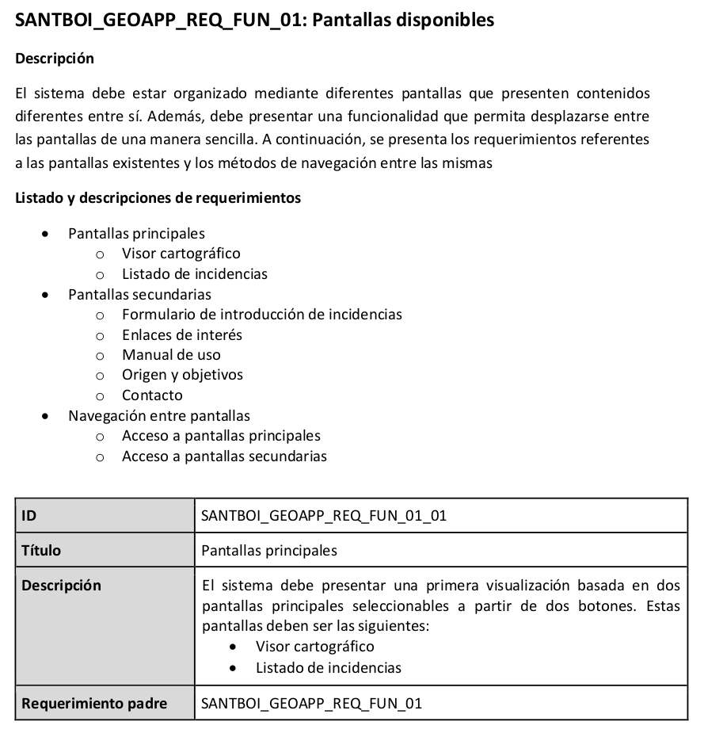
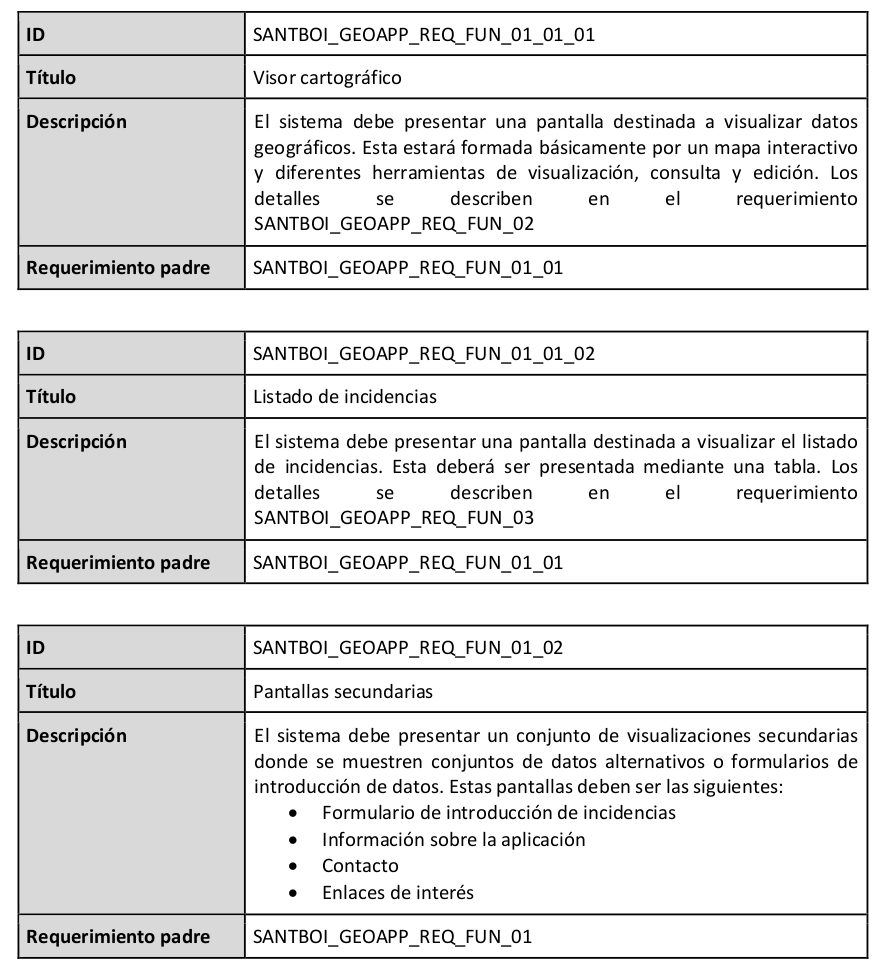
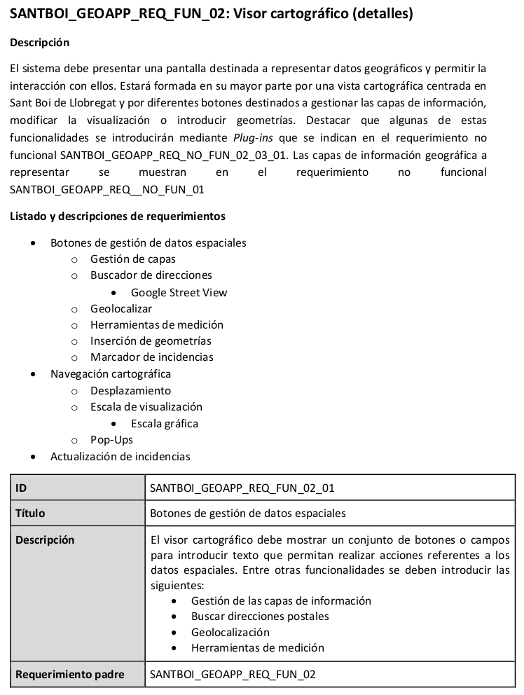

# Requerimientos App

## Requerimientos funcionales

* La aplicación es capaz de activar la localización del dispositivo mediante la función GPS.
* La aplicación es capaz de mostrar la ubicación del dispositivo en el mapa de posición.
* La aplicación es capaz de mostrar en el mapa los datos de los archivos GeoJSON almacenados en él.
* El usuario es capaz de filtrar los datos mostrados de forma interactiva mediante botones de acción.
* El usuario podrá utilizar una barra de búsqueda para encontrar direcciones.
* El usuario podrá realizar acciones de acercar el mapa, alejarlo y moverse por él (zoom in, zoom out y pan).
* El usuario podrá clickar en los elementos mostrados y obtener información adicional.
* El usuario podrá cambiar el mapa de fondo sobre el que se muestra la información.
* El usuario podrá hacer una foto de una incidencia, adjuntar un texto y mandarla a los servidores del sistema.
* El usuario podrá visualizar las incidencias creadas en el mapa y en formato lista, así como sus atributos.
* El sistema será capaz de recoger todas incidencias enviadas por los usuarios y almacenarlas en bases de datos.
* Los administradores podrán gestionar las bases de datos añadiendo o eliminando registros.
* Los administradores podrán modificar los archivos espaciales originales y almacenarlos en los dispositivos mediante actualización de la aplicación.

## Requerimientos no funcionales

* La aplicación se desarrollará para dispositivos Android.
* Los datos georreferenciados de lugares se almacenarán en archivos GeoJSON dentro del propio dispositivo.
* La aplicación se desarrollará en formato de web-app, empleando HTML, CSS, JavaScript y PHP, todos lenguajes y formatos de código abierto.
* El código se compilará utilizando el intérprete Cordova, el cual convertirá los ficheros web en un archivo apk que podrá instalarse en los dispositivos móviles.
* La aplicación se ejecutará empleando el propio software del dispositivo, no siendo necesario ningún programa extra para su funcionamiento.
* Para la gestión de las bases de datos se empleará MySQL.

## Ejemplos

Requerimiento Pantallas disponibles

Requerimiento Visor cartográfico

